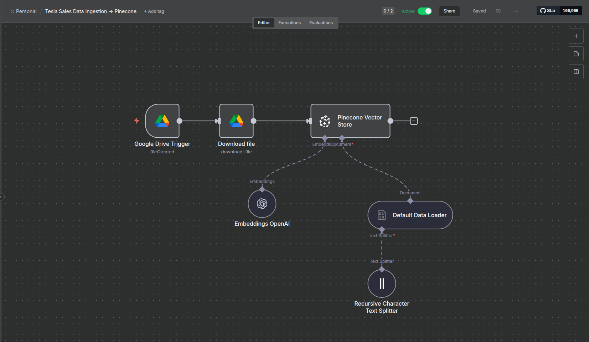
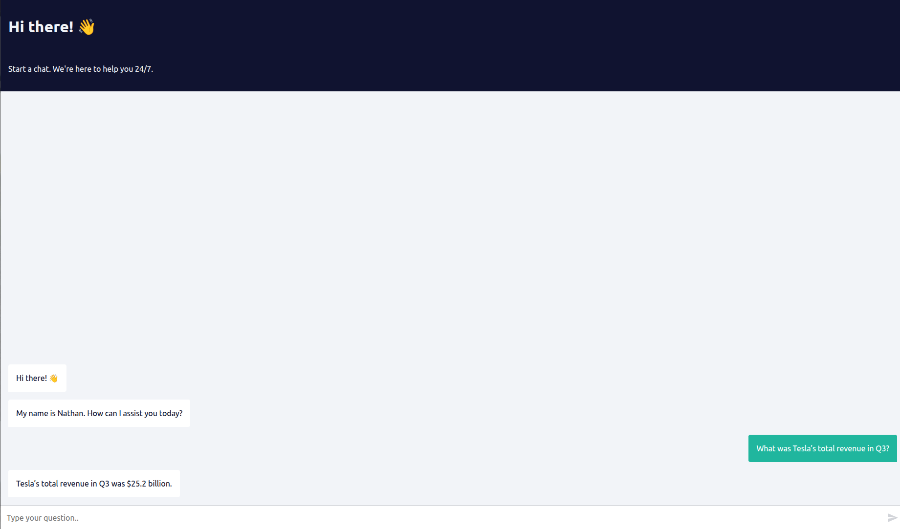
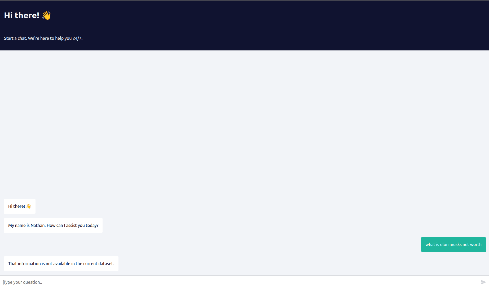

# AI-Powered Financial Insights System (RAG)

## Overview
This project is an AI-powered Retrieval-Augmented Generation (RAG) system designed to answer natural language queries on Tesla’s quarterly sales data.  
It combines automation workflows, vector search, and large language models to generate accurate, grounded responses.

The system is implemented using two independent but connected workflows to clearly separate data ingestion from query-time retrieval.

---

## Problem
Quarterly financial data is typically static and difficult to query interactively. Extracting specific insights often requires manual lookup and analysis, making ad-hoc exploration inefficient.

---

## Solution
I designed a two-stage RAG system that:
- Ingests and indexes structured financial data into a vector database
- Retrieves only relevant context at query time
- Generates responses strictly grounded in indexed data
- Explicitly rejects queries that cannot be answered using available information

This design minimizes hallucinations and improves response reliability.

---

## System Design

### Workflow 1: Data Ingestion and Indexing
This workflow ingests Tesla quarterly sales data from Google Drive, processes the data into chunks, generates embeddings, and stores them in a Pinecone vector database.

Its responsibility is to ensure that all domain knowledge is indexed and searchable before user queries are handled.

---

### Workflow 2: Query and Retrieval (RAG Chatbot)
This workflow powers the chatbot interface. When a user submits a query:
- Relevant context is retrieved from the Pinecone vector store
- The retrieved information is passed to an LLM for response generation
- If the query cannot be answered using indexed data, the system responds that the information is not available

This ensures responses remain grounded in the available data.

---

## Example Interaction

**Query:**
> What was Tesla’s total revenue in Q3?

**Result:**
The system retrieves relevant financial data and generates an accurate, context-aware response.

### Rejected Query Example

**Query:**  
What is Elon Musk’s net worth?

**Result:**  
The system correctly indicates that the information is not available in the indexed dataset, demonstrating controlled and grounded behavior.

---

## Tools & Technologies
- n8n (workflow orchestration)
- Pinecone (vector database)
- OpenAI embeddings and chat models
- Google Drive (data source)

---

## Key Learnings
- Designing RAG pipelines for structured financial data
- Separation of ingestion and retrieval workflows
- Practical use of vector databases for semantic search
- Building grounded AI systems using automation-driven pipelines

---

## Future Improvements
- Add support for additional financial periods and companies
- Improve chunking and retrieval strategies
- Add evaluation metrics for response quality

---

## Workflow Exports
The n8n workflow definitions are included in the `workflows/` directory for reference and reproducibility.
